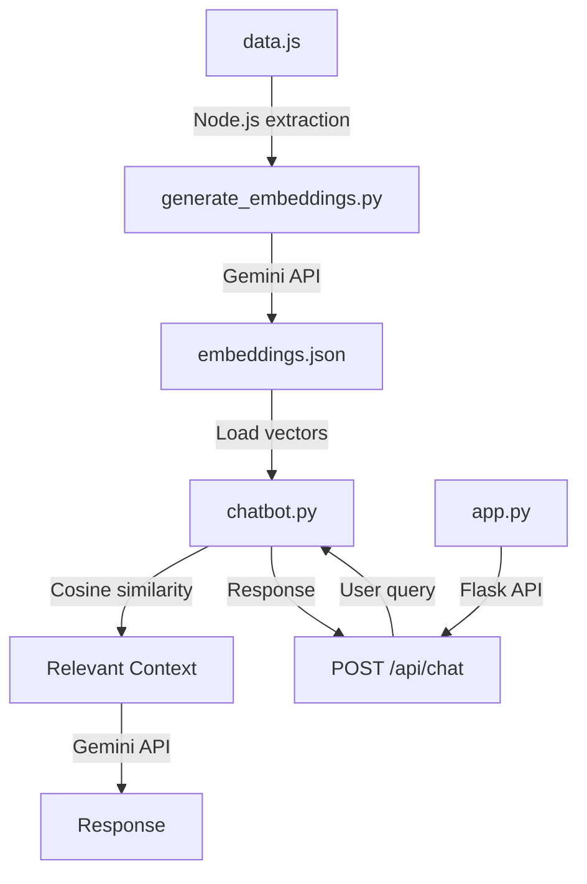
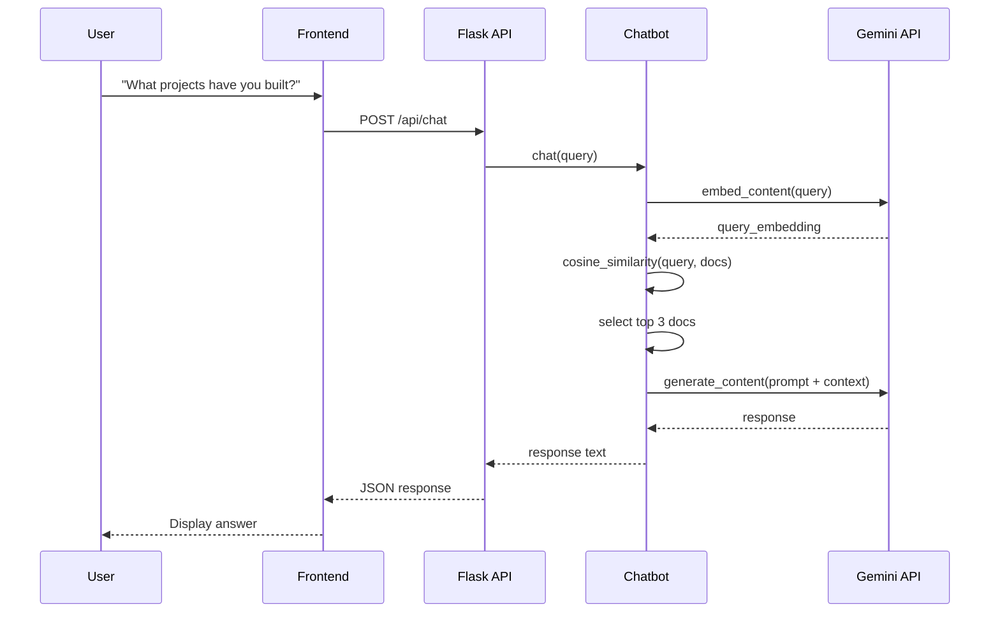

# RAG Backend Implementation Walkthrough

This document provides a comprehensive overview of how the RAG (Retrieval-Augmented Generation) backend is implemented for your portfolio chatbot.

## 🏗️ Architecture Overview

The RAG backend consists of three main components:



1. **Embedding Generation** ([generate_embeddings.py](file:///Users/bhuvanps/Portfolio/rag-backend/generate_embeddings.py)) - Preprocesses portfolio data and creates vector embeddings
2. **Chatbot Logic** ([chatbot.py](file:///Users/bhuvanps/Portfolio/rag-backend/chatbot.py)) - Handles RAG retrieval and response generation
3. **API Server** ([app.py](file:///Users/bhuvanps/Portfolio/rag-backend/app.py)) - Flask server exposing the chatbot via REST API

---

## 📦 Component 1: Embedding Generation

### Purpose
Converts your portfolio data from [data.js](file:///Users/bhuvanps/Portfolio/Portfolio/data.js) into vector embeddings that can be semantically searched.

### Key Steps

#### 1. **Data Extraction** 
```python
def load_data_from_js(file_path: str) -> Dict[str, Any]:
```

- Uses **Node.js subprocess** to execute the JavaScript file
- Appends export logic to extract: `personalDetails`, `projects`, `skillData`, `journeyData`
- Returns parsed JSON data

> [!NOTE]
> This clever approach allows Python to read JavaScript data without manual conversion

#### 2. **Text Chunking** 
```python
def chunk_text(self, text: str, chunk_size: int = 200) -> List[str]:
```

- Splits long text into **200-word chunks**
- Ensures embeddings stay within API limits
- Maintains semantic coherence

#### 3. **Embedding Generation** 
```python
def get_embedding(self, text: str) -> List[float]:
```

- Calls **Gemini API** (`text-embedding-004` model)
- Converts text into high-dimensional vectors (768 dimensions)
- Each vector represents semantic meaning

#### 4. **Portfolio Processing** 

The `process_portfolio` method systematically processes:

| Data Type | Processing | Metadata |
|-----------|-----------|----------|
| **Personal Details** | Name, title, bio, contact info | `type: "about"` |
| **Skills** | Categorized by technology area | `type: "skills"`, `category` |
| **Projects** | Title, description, tags, metrics | `type: "project"`, `title`, `id` |
| **Experience** | Company, role, highlights | `type: "experience"`, `company` |
| **Education** | Degree, institution, period | `type: "education"`, `institution` |
| **Certifications** | Name, issuer | `type: "certifications"` |

#### 5. **Output Format** 

Saves to [embeddings.json](file:///Users/bhuvanps/Portfolio/rag-backend/embeddings.json):
```json
{
  "documents": [
    {
      "content": "Project: Hyperscale...",
      "embedding": [0.123, -0.456, ...],
      "metadata": {"type": "project", "title": "Hyperscale"}
    }
  ],
  "metadata": {
    "model": "text-embedding-004",
    "dimension": 768,
    "total_chunks": 50
  }
}
```

---

## 🤖 Component 2: Chatbot Logic

### Purpose
Implements the RAG pipeline: retrieval → context assembly → response generation.

### Key Components

#### 1. **Initialization** 

```python
class PortfolioChatbot:
    def __init__(self, embeddings_file: str = None):
        self.model = genai.GenerativeModel('gemini-2.5-flash')
        self.embedding_model = 'models/text-embedding-004'
```

- Loads pre-computed embeddings from JSON
- Configures **Gemini 2.5 Flash** for response generation
- Sets up system prompt defining the chatbot persona

> [!IMPORTANT]
> The system prompt instructs the model to:
> - Answer in **first person** as Bhuvan
> - Be **extremely concise**
> - Only use provided context
> - Admit when information is not available

#### 2. **Embedding Loading**   

```python
def load_embeddings(self, file_path: str):
    self.documents = data['documents']
    self.embeddings = np.array([doc['embedding'] for doc in self.documents])
```

- Converts embeddings to **NumPy array** for efficient computation
- Stores document content and metadata separately

#### 3. **Query Embedding**         

```python
def get_query_embedding(self, text: str) -> np.ndarray:
    result = genai.embed_content(
        model=self.embedding_model,
        content=text,
        task_type="retrieval_query"
    )
```

- Converts user question into same vector space as documents
- Uses `task_type="retrieval_query"` for optimized retrieval

#### 4. **Semantic Search** 

```python
def find_relevant_context(self, query: str, top_k: int = 3) -> List[str]:
    query_embedding = self.get_query_embedding(query)
    similarities = np.dot(self.embeddings, query_embedding)
    top_indices = np.argsort(similarities)[-top_k:][::-1]
```

**How it works:**
1. Compute **cosine similarity** between query and all document embeddings
2. Sort by similarity score (dot product)
3. Return **top 3** most relevant chunks
4. Filter out results below **0.3 similarity threshold**

> [!TIP]
> Cosine similarity measures the angle between vectors, making it ideal for semantic search

#### 5. **Response Generation** 

```python
def chat(self, user_query: str) -> str:
    relevant_docs = self.find_relevant_context(user_query)
    context_str = "\n\n".join(relevant_docs)
    
    prompt = f"""
    {self.system_prompt}
    
    Context information:
    {context_str}
    
    User Question: {user_query}
    
    Answer:
    """
    
    response = self.model.generate_content(prompt)
    return response.text
```

**RAG Pipeline:**
1. **Retrieve** relevant context using semantic search
2. **Augment** the prompt with retrieved context
3. **Generate** response using Gemini with context-aware prompt

---

## 🌐 Component 3: Flask API Server

### Purpose
Exposes the chatbot as a REST API endpoint for the frontend.

### Implementation ([app.py](file:///Users/bhuvanps/Portfolio/rag-backend/app.py))

#### 1. **Server Setup** (Lines 1-18)

```python
from flask import Flask, request, jsonify
from flask_cors import CORS
from chatbot import PortfolioChatbot

app = Flask(__name__)
CORS(app)  # Enable cross-origin requests

chatbot = PortfolioChatbot()
```

- Enables **CORS** for frontend integration
- Initializes chatbot on server startup

#### 2. **Chat Endpoint** (Lines 21-37)

```python
@app.route('/api/chat', methods=['POST'])
def chat():
    data = request.json
    user_message = data.get('message')
    
    response = chatbot.chat(user_message)
    return jsonify({"response": response})
```

**API Contract:**
- **Endpoint:** `POST /api/chat`
- **Request:** `{"message": "What are your skills?"}`
- **Response:** `{"response": "I have expertise in..."}`

#### 3. **Error Handling**

```python
if not chatbot:
    return jsonify({"error": "Chatbot not initialized"}), 500

if not user_message:
    return jsonify({"error": "No message provided"}), 400
```

Handles initialization failures and missing parameters gracefully.

---

## 🔄 Complete Data Flow

Here's how a user query flows through the system:


### Step-by-Step Breakdown

1. **User asks question** → Frontend captures input
2. **POST request** → Sent to `/api/chat` endpoint
3. **Query embedding** → Convert question to vector
4. **Similarity search** → Find top 3 relevant chunks
5. **Context assembly** → Combine retrieved documents
6. **Prompt construction** → Add system prompt + context
7. **LLM generation** → Gemini generates answer
8. **Response return** → JSON sent back to frontend


---

## 🛠️ Technical Highlights

### Why This Implementation Works Well

| Feature | Benefit |
|---------|---------|
| **Vector Embeddings** | Semantic search beyond keyword matching |
| **Chunking Strategy** | Handles long documents while maintaining context |
| **Cosine Similarity** | Fast, efficient retrieval from pre-computed vectors |
| **Metadata Tagging** | Enables future filtering by type (projects, skills, etc.) |
| **Gemini 2.5 Flash** | Fast, cost-effective LLM for conversational responses |
| **CORS Enabled** | Seamless frontend integration |

### Performance Characteristics

- **Embedding Generation:** One-time process, ~30-60 seconds
- **Query Processing:** ~1-2 seconds (embedding + retrieval + generation)
- **Memory Usage:** ~500KB for embeddings.json
- **API Calls:** 1 embedding call + 1 generation call per query

---

## 📝 Key Files Summary

| File | Purpose |
|------|---------|
| [generate_embeddings.py](file:///Users/bhuvanps/Portfolio/rag-backend/generate_embeddings.py) | Extract data.js → Generate embeddings → Save JSON |
| [chatbot.py](file:///Users/bhuvanps/Portfolio/rag-backend/chatbot.py) | Load embeddings → Semantic search → Generate responses |
| [app.py](file:///Users/bhuvanps/Portfolio/rag-backend/app.py) | Flask server → REST API endpoint |
| [embeddings.json](file:///Users/bhuvanps/Portfolio/rag-backend/embeddings.json) | Pre-computed vector database |

---

## 🚀 Usage Workflow

### Initial Setup
```bash
# Generate embeddings (run once or when data.js changes)
python generate_embeddings.py

# Start the server
python app.py
```

### Making Queries
```bash
curl -X POST http://localhost:5001/api/chat \
  -H "Content-Type: application/json" \
  -d '{"message": "What are your top projects?"}'
```

### Updating Data
When you modify [data.js](file:///Users/bhuvanps/Portfolio/Portfolio/data.js):
1. Run `python generate_embeddings.py` to regenerate embeddings
2. Restart the Flask server to reload the updated embeddings

---

## 💡 Design Decisions

> [!NOTE]
> **Why RAG instead of fine-tuning?**
> - Portfolio data changes frequently
> - No need to retrain models
> - Lower cost and faster iteration

> [!TIP]
> **Why text-embedding-004?**
> - Latest Gemini embedding model
> - 768 dimensions balances quality and performance
> - Optimized for retrieval tasks

> [!IMPORTANT]
> **Why chunk by 200 words?**
> - Balances context size and specificity
> - Prevents embedding dilution
> - Stays within API token limits

---

## 🎯 Summary

Your RAG backend implements a **three-stage pipeline**:

1. **Offline:** Extract portfolio data → Generate embeddings → Store vectors
2. **Runtime:** User query → Semantic search → Retrieve context
3. **Generation:** Context + Query → LLM → Personalized response

This architecture enables your portfolio to answer questions intelligently by combining the power of semantic search (finding relevant information) with generative AI (crafting natural responses), all while maintaining accuracy by grounding responses in your actual portfolio data.
